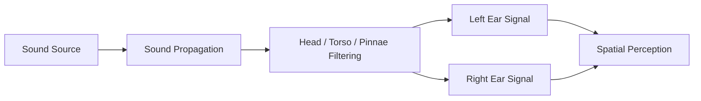

# Spatial Audio Concepts

This section briefly introduces key concepts used throughout the **Binaural Rendering Toolbox (BRT)**.  
The goal is not to provide a full theoretical treatment, but to give enough background to understand how these concepts are used within the BRT framework.

For deeper explanations, external references are provided for each concept.

---

## Head-Related Transfer Function (HRTF)

A **Head-Related Transfer Function (HRTF)** describes how an incoming sound wave is filtered by a listener's **head, torso, and outer ears (pinnae)** before reaching the eardrums. These filtering effects depend on the **direction and distance of the sound source**, and they provide the cues that allow humans to perceive sound spatially.

In practice, HRTFs are usually represented as a set of **Head-Related Impulse Responses (HRIRs)**. Each HRIR captures the acoustic response from a specific source position to the listener's **left and right ears**.

Measurement directions are typically described using:

- **Azimuth** (horizontal angle around the listener)
- **Elevation** (vertical angle)
- **Distance** from the listener

When an audio signal is **convolved with the HRIR corresponding to a specific direction**, the resulting signal reproduces the spatial filtering cues that make the sound appear to originate from that location.

!!! info "HRTFs in BRT"
    The **BRT framework** represents HRTFs as collections of **HRIRs associated with spatial coordinates** (azimuth, elevation, and distance).

The system is designed to support **arbitrary distributions of measurement directions**, meaning that it does **not require a regular spherical grid** and does not impose minimum spatial density constraints.

This flexibility allows BRT to work with a wide range of existing HRTF datasets.

### External references

* Bosun Xie. Head-Related Transfer Function and Virtual Auditory Display. Springer, 2013.
* [https://en.wikipedia.org/wiki/Head-related_transfer_function](https://en.wikipedia.org/wiki/Head-related_transfer_function)
* [https://www.sofaconventions.org](https://www.sofaconventions.org)

---

## Head-Related Impulse Response (HRIR)

A **Head-Related Impulse Response (HRIR)** is the **time-domain representation of the HRTF** for a specific spatial direction.

Each HRIR corresponds to the impulse response measured between a sound source located at a given position and the listener's ears. In binaural audio systems, two HRIRs are typically recorded for each measurement direction:

* one for the **left ear**
* one for the **right ear**

HRIRs are usually measured using **dummy heads** or real listeners equipped with miniature microphones placed at the ear canals.

In binaural rendering systems, spatial audio is generated by **convolving the input signal with the HRIR pair corresponding to the source direction**.

### External references

* [https://en.wikipedia.org/wiki/Head-related_transfer_function](https://en.wikipedia.org/wiki/Head-related_transfer_function)
* [https://sofacoustics.org](https://sofacoustics.org)

---

## Binaural Room Impulse Response (BRIR)

A **Binaural Room Impulse Response (BRIR)** extends the concept of HRIR by including the **acoustic effects of an environment**.

While an HRIR models only the filtering caused by the listener's anatomy, a BRIR also includes:

* **early reflections** from room surfaces
* **late reverberation**
* the **interaction between the listener and the room acoustics**

A BRIR therefore captures the complete acoustic response between a sound source and the listener in a particular environment.

BRIRs are widely used in spatial audio rendering systems to reproduce **realistic acoustic environments over headphones**.

### External references

* Bosun Xie. Head-Related Transfer Function and Virtual Auditory Display. Springer, 2013.
* Hilmar Lehnert, Jens Blauert. [Principles of binaural room simulation](https://www.sciencedirect.com/science/article/pii/0003682X9290049X)
* [https://en.wikipedia.org/wiki/Impulse_response](https://en.wikipedia.org/wiki/Impulse_response)
* [https://www.sofaconventions.org](https://www.sofaconventions.org)

---

## Ambisonics

**Ambisonics** is a spatial audio representation technique that encodes a sound field using **spherical harmonics**. Instead of representing audio as signals tied to specific loudspeakers, ambisonics represents the **entire sound field around a listener**.

This representation has several advantages:

* the sound field can be **rotated or manipulated mathematically**
* it can be **decoded to different playback systems**
* it supports **efficient spatial audio processing**

In binaural rendering systems, ambisonic signals are typically converted to binaural signals through a **binaural decoding stage**, which uses HRTFs or ambisonic-domain impulse responses.

### External references

* [https://en.wikipedia.org/wiki/Ambisonics](https://en.wikipedia.org/wiki/Ambisonics)
* [https://ambisonics.iem.at](https://ambisonics.iem.at)

