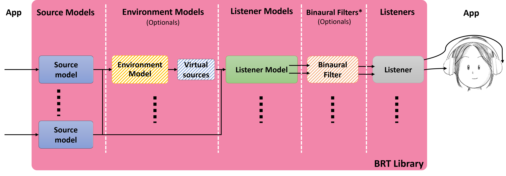
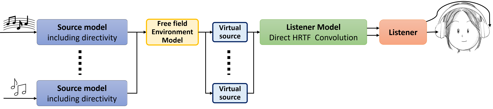
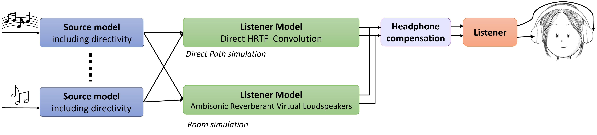
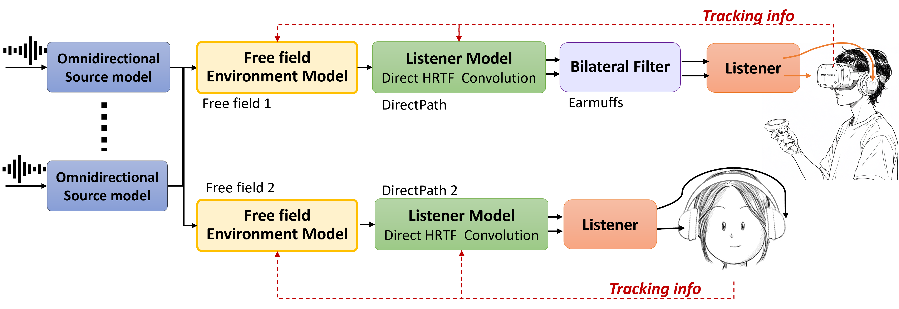

# BRT Library: General Overview

The **Binaural Rendering Toolbox (BRT)** is an advanced C++ library designed to support psychoacoustic research and the development of immersive audio applications. As a core component of the BRT Toolbox, the library provides a modular, open-architecture framework that facilitates the creation of dynamic and reproducible virtual acoustic scenarios. This section introduces the main features, purpose, and usage of the BRT Library.

## Introduction

The BRT Library was developed as part of the SONICOM project to address the increasing need for flexible, extensible, and reproducible tools in psychoacoustic research. It builds upon the experience gained from the 3D Tune-In Toolkit while introducing significant architectural improvements, including modularity and ease of extension. The library is intended for researchers and developers aiming to simulate complex binaural scenarios, such as real-time dynamic environments with multiple listeners and sound sources.

## Key Features

1. **Modularity and Extensibility**:
    - The library adopts a header-only structure, simplifying integration into various projects.
    - It is organized into three layers:
        - **Top Layer**: This layer comprises high-level modules, referred to as "models," which include listener, source, and environment models, as well as binaural filters. These modules are interconnected to create diverse acoustic scenarios. *Developers using the BRT Library* to build audio applications will primarily interact with this layer, as it provides a straightforward interface for simulating complex binaural environments.
        - **Middle Layer**: This layer contains a collection of signal processing and service modules that serve as the foundation for the high-level models. Signal processing modules include components like convolvers and filters, while service modules manage data such as impulse responses. *Developers contributing new algorithms or models* to the library will need to understand this layer, as it provides the building blocks for extending the library's functionality.
        - **Bottom Layer**: At the core of the library, this layer consists of foundational classes and templates that define the modular architecture. It implements mechanisms for interconnecting modules and ensures the flexibility and scalability of the library. This layer is primarily relevant for developers seeking to modify or enhance the library's architecture itself.
2. **Dynamic Virtual Acoustics**:
    - Supports anechoic and reverberant environments.
    - Enables simulation of near-field effects and dynamic HRTF swapping.
    - Supports 6DoF for both Listeners and sources
3. **Applications and Portability**:
    - The library, written in standard C++, is designed for deployment on various platforms, including standalone executables, mobile, and wearable devices. Its modular and multilevel structure enables flexible configurations, making deployment adaptable to diverse systems.
## Purpose and Applications

The BRT Library provides a flexible and extensible framework tailored to the needs of researchers and developers in psychoacoustics, auditory modeling, and immersive audio rendering. Its design supports a variety of use cases, including:

- **Custom Binaural Rendering Pipelines**: Configure and implement tailored audio rendering workflows for specific experimental or application needs.
- **Dynamic Auditory Modeling**: Test and validate auditory models with dynamic scenarios, supporting 6DoF of both listeners and sources.
- **Rapid Testing of Simulated Characteristics**: Use integrated applications for quick testing of BRIRs, HRTFs, and other auditory properties.
- **Full Process Chain Characterization**: Characterize complete models, including source, environment, and listener chains, as directional impulse responses or log binaural stimuli along with the position and orientation data used for synthesis.

### Developer-Friendly Design

The library minimizes the complexity of implementing novel algorithms and adapting to unique research requirements. Its modular structure offers well-defined internal interfaces and reusable building blocks, enabling efficient customization. Developers can:

- Use **predefined modules** to simulate specific acoustic scenarios, such as free-field or room acoustics.
- Extend the library by creating custom **low-level processing** or **high-level modeling** modules to support new features or research needs.

### Active Development and Future Capabilities

The BRT Library is actively maintained and continuously evolving. Planned enhancements include:

- Support for **multi-listener scenarios**, enabling collaborative and interactive auditory experiments.
- Integration of **advanced reverberation models**, such as hybrid methods combining Image Source Methods (ISM) with other techniques for the reverberation tail.
- Development of **hearing loss and hearing aid simulations**, broadening the scope of auditory applications.

---

## Description

The library is organized into three layers, as previously discussed. From the perspective of a C++ programmer[^1], using the library mainly involves working with high-level and service modules.

[^1]: If you prefer a higher-level approach, you can use our applications and control them via OSC commands. For more details, see [Applications](/BRT-Documentation/applications/).

### High-Level Modules

High-level modules are responsible for audio rendering. Each module models specific physical and/or psychoacoustic phenomena, depending on the use case. The following types of models have been implemented, grouped into four categories:

- **Source Models**: Each monaural sound source to be rendered requires the instantiation of a source model. These models serve as the main entry points to the library for applications during rendering. At a minimum, applications must provide the audio samples of each source for every frame and, if applicable, update their position and orientation.
    - [Omnidirectional Source Model](../library/source-models/simple-omnidirectional-source-model.md)
    - [Directional Source Model](../library/source-models/directivity-source-model.md)

- **Listener Models**: Listener models generate binaural audio by receiving a single audio channel per source and producing two output channels (left and right ears). They can actually include Listener+Environment models using Binaural Room Impulse Responses (BRIR). They are categorized as follows:
    - [HRTF Convolution Models](./listener-models/hrtf-models/index.md): 
    These models simulate sound perception using Head-Related Transfer Functions (HRTF). Signals from sound sources are convolved with binaural impulse responses stored in HRTF Service modules. Whose data is usually read from a SOFA file. Currently two such models have been implemented: **Direct HRTF Convolution Model** and **Ambisonic BRIR Convolution Model**.
    - [BRIR Convolution Models](./listener-models/rir-models/index.md): 
    These models use Binaural Room Impulse Responses (BRIR) to simulate acoustic spaces, convolving source signals with room-specific responses stored in HRBRIR service modules. The RIR data will typically be read from a SOFA file and may contain impulse responses with the transmitter and receiver located at various locations in the room. Currently two models have been implemented: **Direct BRIR Convolution Model** and **Ambisonic BRIR Convolution Model**.

- **Environment Models**: These models simulate various acoustic environments:
    - [Free Field](../library/environment-models/freefield-environment-model.md): Simulates propagation in a free-field environment, including propagation delay, attenuation, and filtering.
    - [SDN](../library/environment-models/sdn-environment-model.md): Simulates room reverberation using the Scattering Delay Networks method.
    - *ISM*: Simulates room reverberation using the Image Source Method *(under development)*.
    - *Hybrid: ISM + Convolution*: Simulates room reverberation where early reflections are modeled using the Image Source Method, and the reverberant tail is simulated through convolution with a BRIR *(under development)*.

- **Bilateral Filters**: They perform filtering on binaural signals.
    - [SOS Filters](../library/bilateral-filters/sos-filters.md): Generic module to perform binaural filtering based on second-order sections, enabling the simulation of devices such as ear protection devices of headphone compensations.
    - _Non-linear filters: support advanced models such as **hearing loss simulation** (under development)_.
    - _FIR filters: support applications such as **headphone compensation** (under development)_.

- **Listener**: Each listener instantiated in the BRT library represents a “real” listener for which you want to render binaural audio. The application must keep its position/orientation updated and must at the end of each audio frame collect the output samples. 
 
### Service Modules

Service modules store the essential data required for rendering. This data typically comes from SOFA files, although other formats could be used. Key service modules include:

- [HRTF](../library/service-modules/service-hrtf.md): Stores head-related impulse responses indexed by azimuth and elevation.
- [BRIR](../library/service-modules/service-hrbrir.md): Stores room-related impulse responses indexed by azimuth and elevation.
- [DirectivityTF](../library/service-modules/service-directivity-tf.md): Stores transfer functions of a sound source based on the position of the listener and the sources.
- [SOSFilters](../library/service-modules/service-sos-filters.md): Stores coefficients for second-order sections of a filter, which can be fixed or vary based on distance, azimuth, and/or elevation.
- [AmbisonicBIR](./service-modules/service-ambisonic-bir.md): Stores the impulse responses of the virtual loudspeakers in the ambisonic domains, in order to achieve a process with simultaneous impulse responses convolution and ambisonic decoding.
---

## Usage

To render audio using the library, the required modules must be instantiated and interconnected based on the desired simulation (configuration). This is managed through the `brtManager` class [URL]. For detailed instructions, refer to the **Setup/Examples** section.

### General Workflow

The diagram below outlines the modular interconnections in the BRT Library and the typical workflow for rendering audio:

1. **Source Models**: Instantiate a source model for each monaural sound source. The application is responsible for feeding these models with audio samples for each frame and updating their position and orientation as needed.

2. **Listener Models**: Connect source models to listener models to generate binaural audio. If an environment simulation is required, source models should first be connected to environment models.

3. **Environment Models (Optional)**: These models simulate acoustic spaces and produce virtual sources, which are then connected to the listener models. Applications only need to connect the modules; the library handles virtual source generation.

4. **Bilateral Filters (Optional)**: To simulate auditory devices, such as headphones, connect a bilateral filter between listener models and listener outputs.

5. **Listeners**: Instantiate one listener module for each real listener. The application must collect the output samples from each listener at the end of every audio frame.

This modular approach provides flexibility while ensuring that all components interact seamlessly. The application is tasked with managing input and output data flow, while the library takes care of the processing.

    
    
Generic connection diagram of the BRT models

Below are examples of configurations that can be created:

**Example 1 - Basic Anechoic Simulation**: Combine a listener model with source models for anechoic rendering.

    
    
Configuration for direct path simulation (anechoic simulation)

**Example 2 - Propagation simulation**: Add an environment model to simulate propagation.

    
    
Configuration for direct path simulation adding propagation in a free environment (anechoic simulation + propagation)

**Example 3 - Hybrid simulation and custom filters**: Independent simulation for direct sound and room reverberation, using a hybrid approach. In addition, a bilateral filter is added to simulate hearing protectors or to compensate for headphones.

    
    
Configuration with direct path (anechoic) and reverberation (room) simulation, plus filtering.

**Example 4 - Simultaneous rendering of two listeners**: Simultaneous and independent rendering of two listeners. Each can have their own position in space, HRTF, etc. In addition, filtering is added to one of the listeners to simulate ear protective devices.

    
    
Simultaneous rendering of two listeners

For further technical details and code examples, visit the official repository: <a href="https://github.com/GrupoDiana/BRTLibrary" target="_blank">BRT Library GitHub</a>.
