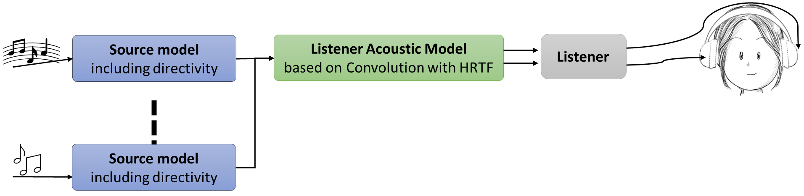
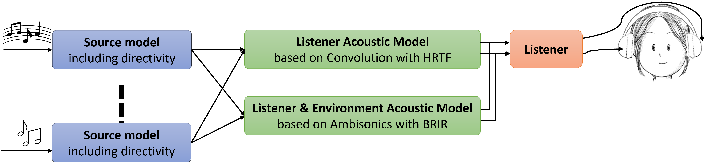
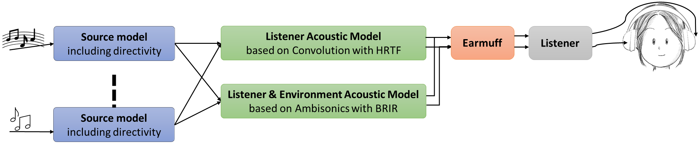

# BRT Library: General Overview
:warning:*(Ready for review)*:warning:

The **Binaural Rendering Toolbox (BRT)** is an advanced C++ library designed to support psychoacoustic research and the development of immersive audio applications. As a core component of the BRT Toolbox, the library provides a modular, open-architecture framework that facilitates the creation of dynamic and reproducible virtual acoustic scenarios. This section introduces the main features, purpose, and usage of the BRT Library.

## Introduction

The BRT Library was developed as part of the SONICOM project to address the increasing need for flexible, extensible, and reproducible tools in psychoacoustic research. It builds upon the experience gained from the 3D Tune-In Toolkit while introducing significant architectural improvements, including modularity and ease of extension. The library is intended for researchers and developers aiming to simulate complex binaural scenarios, such as real-time dynamic environments with multiple listeners and sound sources.

## Key Features

1. **Modularity and Extensibility**:
    - The library adopts a header-only structure, simplifying integration into various projects.
    - It is organized into three layers:
        - **Bottom Layer**: Implements low-level, template-based interconnection mechanisms using the observer design pattern.
        - **Middle Layer**: Contains processing modules (e.g., convolvers, filters) and service modules (e.g., SOFA file readers).
        - **Top Layer**: Combines modules into high-level models (e.g., listener, source, and environment models).
2. **Dynamic Virtual Acoustics**:
    - Supports anechoic and reverberant environments.
    - Enables simulation of near-field effects and dynamic HRTF swapping.
3. **Applications and Portability**:
    - Easily deployable on various systems, including standalone executables, mobile and wearable devices.

## Purpose and Applications

The BRT Library provides a flexible and extensible framework tailored to the needs of researchers and developers in psychoacoustics, auditory modeling, and immersive audio rendering. Its design supports a variety of use cases, including:

- **Custom Binaural Rendering Pipelines**: Configure and implement tailored audio rendering workflows for specific experimental or application needs.
- **Dynamic Auditory Modeling**: Test and validate auditory models with dynamic scenarios, including moving listeners and sources.
- **Realistic Environment Simulation**: Accurately simulate real-time auditory environments, incorporating effects such as reverberation and HRTF-based spatialization.

### Developer-Friendly Design

The library minimizes the complexity of implementing novel algorithms and adapting to unique research requirements. Its modular structure offers well-defined internal interfaces and reusable building blocks, enabling efficient customization. Developers can:

- Use **predefined modules** to simulate specific acoustic scenarios, such as free-field or room acoustics.
- Extend the library by creating custom **low-level processing** or **high-level modeling** modules to support new features or research needs.

### Active Development and Future Capabilities

The BRT Library is actively maintained and continuously evolving to meet the growing demands of the research and development community. Planned enhancements include:

- Support for **multi-listener scenarios**, enabling collaborative and interactive auditory experiments.
- Integration of **advanced reverberation models**, such as hybrid methods combining image sources and convolution.
- Development of **hearing loss and hearing aid simulations**, broadening the scope of auditory applications.

By combining flexibility, precision, and extensibility, the BRT Library empowers users to push the boundaries of psychoacoustics and immersive audio research.

---

## Description

The library is organized into three layers, as previously discussed. From the perspective of a C++ programmer[^1], using the library mainly involves working with high-level and service modules.

[^1]: If you prefer a higher-level approach, you can use our applications and control them via OSC commands. For more details, see [Applications](/BRT-Documentation/applications/).

### High-Level Modules

High-level modules are responsible for audio rendering. Each module models specific physical and/or psychoacoustic phenomena, depending on the use case. Currently, several types of models have been implemented, grouped into four categories:

- **Source Models: Simulate an audio source**
    - [Simple Omnidirectional Source Model](../library/source-models/simple-omnidirectional-source-model.md)
    - [Directional Source Model](../library/source-models/directivity-source-model.md)

- **Listener Models**
    - [HRTF Convolution Models](./listener-models/hrtf-models/index.md): These models use head impulse responses (HRTF) to realistically simulate the sound perceived by a user. They work by convolving the signals from the sound sources with the binaural head impulse response (HRTF). This HRTF data is usually read from a SOFA file. Currently two such models have been implemented: *Direct HRTF Convolution Model* and *Ambisonic BRIR Convolution Model*.

    - [BRIR Convolution Models](./listener-models/rir-models/index.md): These models exploit room impulse responses (RIR) to simulate realistic acoustic spaces. They work by convolving the signals from the sound sources with the room's binaural impulse response (RIR). The RIR will typically be read from a SOFA file and may contain impulse responses with the transmitter and receiver located at various locations in the room. Currently two models have been implemented: *Direct BRIR Convolution Model* and *Ambisonic BRIR Convolution Model*.

- **Environment Models**:
    - [Free Field](../library/environment-models/freefield-environment-model.md): Simulates propagation in a free-field environment, including propagation delay, attenuation, and filtering.
    - [SDN](../library/environment-models/sdn-environment-model.md): Simulates room reverberation using the Scattering Delay Networks method [URL].
    - *ISM*: Simulates room reverberation using the Image Source Method *(Under development)*.
    - *Hybrid: ISM + Convolution*: Simulates room reverberation where early reflections are modeled using the Image Source Method, and the reverberant tail is simulated through convolution with a BRIR *(Under development)*.

- **Binaural Filters**:
    - [SOS Filters](../library/binaural-filters/sos-filters.md): Perform binaural filtering based on second-order sections, enabling the simulation of devices such as headphones.

### Service Modules

Service modules store the essential data required for rendering. This data typically comes from SOFA files, although other formats could be used. Key service modules include:

- [HRTF](../library/service-modules/service-hrtf.md): Stores head-related impulse responses indexed by azimuth and elevation.
- [BRIR](../library/service-modules/service-brir.md): Stores room-related impulse responses indexed by azimuth and elevation.
- [DirectivityTF](../library/service-modules/service-directivity-tf.md): Stores transfer functions of a sound source based on the position of the listener and the sources.
- [SOSFilters](../library/service-modules/service-sos-filters.md): Stores coefficients for second-order sections of a filter, which can be fixed or vary based on distance, azimuth, and/or elevation.

---

## Usage

To render audio using the library, the required modules must be instantiated and interconnected based on the desired simulation (configuration). This is managed through the `brtManager` class [URL]. See the **Setup/Examples** section for detailed guidance. Below are examples of configurations that can be created:

**Example 1 - Basic Anechoic Simulation**: Combine a listener model with source models for anechoic rendering.

    
    
Configuration with an anechoic simulation.

**Example 2 - Room Simulation**: Add an environment model to simulate reverberation.

    
    
Configuration with anechoic and reverberation simulation.

**Example 3 - Custom Filters**: Incorporate binaural filters for simulating specific devices like headphones or earmuffs.

    
    
Configuration with anechoic and reverberation simulation, plus filtering.

For further technical details and code examples, visit the official repository: <a href="https://github.com/GrupoDiana/BRTLibrary" target="_blank">BRT Library GitHub</a>.
