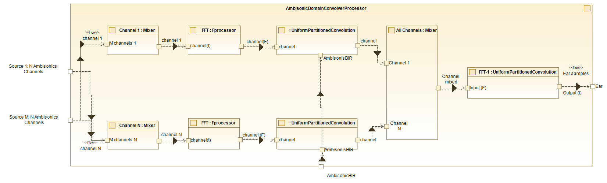

# Ambisonic Domain Convolver Processor

The **Ambisonic Domain Convolver Processor** is a system designed for processing Ambisonic audio channels, performing frequency-domain transformations, convolutions, and mixing to produce spatially accurate sound for binaural listening. The processor handles multiple input channels and applies several processing stages, including FFT, convolution with Ambisonic BIR, and final mixing to create the output for the listener's ears.

## Architecture

The internal block diagram of this class is as follows:

{ style="display: block; margin: 0 auto; max-width: 100%;" }

  Ambisonic Domain Convolver Processor - Internal diagram.

As it is shown in the diagram, the **Ambisonic Domain Convolver Processor** takes multiple Ambisonic channels, applies FFT processing, convolves with Ambisonic BIR to create spatial effects, mixes the processed channels, and delivers the final output as binaural ear samples, simulating an immersive listening experience for the listener.

### Key Components and Flow:

1. **Channel Mixer**: Each mixer processes the respective channels (`channel 1` through `channel N`) from each sound source, for further frequency-domain transformation.

2. **FFT Processor**: The *FFT Processor* blocks apply a Fast Fourier Transform. Each processed channel goes to Uniform Partitioned Convolution.

3. **Uniform Partitioned Convolution**: The frequency-domain channels are passed into the [*Uniform Partitioned Convolution*](./uniform-partitioned-convolution.md) blocks. These blocks convolve the signals with the *AmbisonicBIR*.

4. **All Channels - Mixer**: The convolved outputs from all channels (`Channel 1` through `Channel N`) are combined in the *All Channels - Mixer*. This step ensures the final output integrates contributions from all Ambisonic channels.

5. **Final Convolution and Output**: The mixed signal (`Channel mixed`) undergoes a final convolution step in the *FFT : UniformPartitionedConvolution* block. The result is output as *Ear samples*, simulating spatial audio perception at the listener's ears.

For C++ developer

(In progress)

