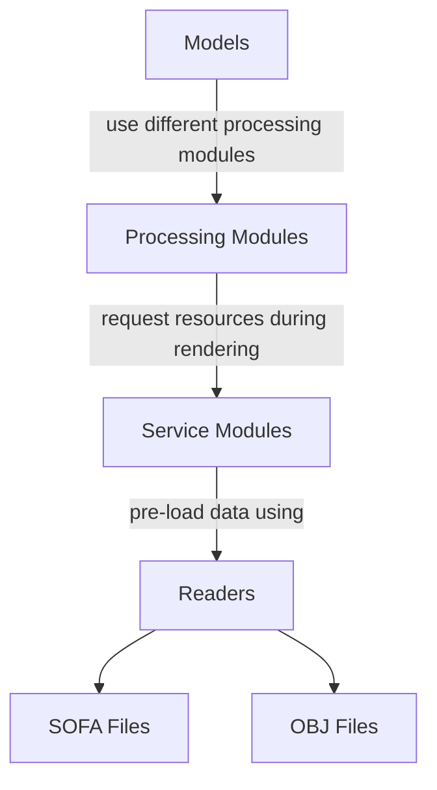

<!--# Service Modules

Service modules are auxiliary components designed to manage and supply the essential resources required for process models to perform binaural audio synthesis algorithms effectively. These resources include various key elements, such as the Head-Related Transfer Function (HRTF), which is critical for simulating the direct sound path perceived by the listener model; the Binaural Room Impulse Response (BRIR), which enables accurate simulation of room reverberation effects; and directivity data, which is vital for capturing the directional characteristics of sound sources. Additionally, second-order filters are employed to accurately model near-field effects, ensuring precise spatial audio reproduction even in close-proximity scenarios. Together, these resources form the foundation for creating immersive and realistic binaural audio experiences.

Los servicios que se pueden al

Currently, five service modules are implemented:

- [HRTF](service-hrtf.md): Stores head-related impulse responses indexed by azimuth and elevation.
- [BRIR](service-hrbrir.md):  Stores room-related impulse responses indexed by azimuth and elevation.
- [Directivity TF](service-directivity-tf.md): Stores transfer functions of a sound source based on the position of the listener and the sources.
- [SOS Coefficients](service-sos-coefficients.md): Stores coefficients for second-order sections of a filter, which can be fixed or vary based on distance, azimuth, and/or elevation.
- [Ambisonincs BIR](./service-ambisonic-bir.md): Stores the impulse responses of the virtual loudspeakers in the ambisonic domains, in order to achieve a process with simultaneous impulse responses convolution and ambisonic decoding.
- [General FIR](./service-general-fir.md):  Stores impulse responses indexed by azimuth and elevation.
- [Room](./service-room.md): It stores the vertices and walls of a room. It also stores the absorption coefficients per band for each of the walls.

-->
# Service Modules

Service modules are auxiliary components responsible for managing and providing the resources required by the **Processing Models** to execute **binaural audio rendering algorithms** efficiently.

These resources include several key elements used during spatial audio processing:

* **[Head-Related Transfer Functions (HRTFs)](../concepts/index.md#conceptsHRTF)**, which simulate the direct sound path perceived by the listener model.
* **[Binaural Room Impulse Responses (BRIRs)](../concepts/index.md#conceptsBRIR)**, used to reproduce the reverberation characteristics of acoustic environments.
* **Source directivity data**, which represent the directional radiation patterns of sound sources.
* **Second-order filter section (SOS) coefficients**, which allow accurate modeling of near-field effects.
* **FIR filter coefficients**, which can be used for headphone equalization or hearing-protection simulations.
* **Impulse responses of virtual loudspeakers in the [Ambisonics](../concepts/ambisonics.md) domain**, enabling simultaneous convolution and ambisonic decoding.
* **Geometric and acoustic descriptions of rooms**, used to simulate acoustic environments.

!!! info "Spatial organization"
    Most resources managed by the service modules are **spatially indexed by azimuth, elevation, and distance**. 

    Non-spatial resources are also supported, such as FIR coefficients for headphone compensation filters.

Together, these resources provide the foundation required to generate **realistic and immersive binaural audio experiences**.

---

## Architecture Overview

The interaction between the main architectural components of the BRT framework is illustrated below.

* **Processing Models** implement the binaural rendering algorithms.
* **Service Modules** store and organize the spatial audio resources used by those algorithms.
* **Readers** load the resources from external data formats.

!!! info "Supported formats"
    The BRT library includes readers capable of loading spatial audio resources from <a href="https://www.sofaconventions.org/mediawiki/index.php/SOFA_(Spatially_Oriented_Format_for_Acoustics)" target="_blank">**SOFA**</a> and <a href="https://en.wikipedia.org/wiki/Wavefront_.obj_file" target="_blanl">**OBJ**</a> formats.
    For more details see the **[READERS](../readers/index.md)** section.

---

## Available Service Modules

The following service modules are available for storing and managing spatial audio resources.

| Module                            | Description                                                                                                                                                                               |
| --------------------------------- | ----------------------------------------------------------------------------------------------------------------------------------------------------------------------------------------- |
| **[SphericalFIRTable](./service-spherical-fir-table.md)**             | Stores FIR-based spatial data such as **HRTFs, BRIRs, source directivity information, and general FIR filter coefficients**.                                                              |
| **SphericalInterpolatedFIRTable** | Stores **HRTF and source directivity data** and generates a **regular spherical grid** through interpolation, providing a predictable spatial structure.                                  |
| **SphericalSOSTable**             | Stores **second-order filter section (SOS) coefficients**, which may be constant or vary depending on **distance, azimuth, and/or elevation**.                                            |
| **AmbisonicBRIR**                 | Stores the **impulse responses of virtual loudspeakers in the ambisonic domain**, enabling a pipeline where **impulse response convolution and ambisonic decoding occur simultaneously**. |
| **Room**                          | Stores the **geometric and acoustic description of a room**, including its **vertices, walls, and frequency-band absorption coefficients** for each surface. An addition to the MTL format has been defined in order to store this acoustic information.                              |
