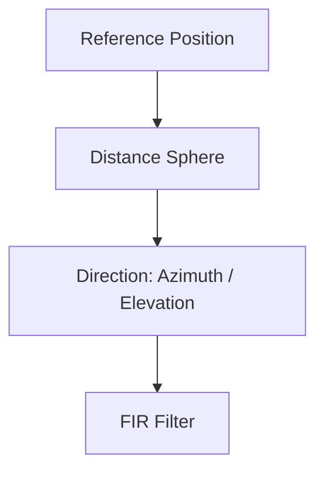
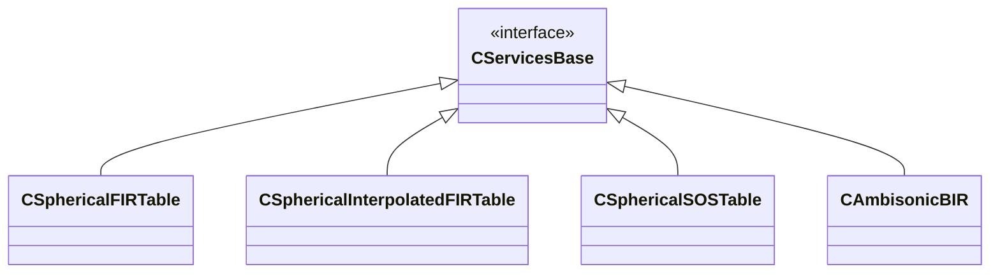

# Spherical FIR Table

## Overview

_SphericalFIRTable_ is a **Service Module** that stores collections of **Finite Impulse Response (FIR) filters organized in spherical coordinates**.  
It is designed to manage spatially indexed filter datasets such as HRTFs, BRIRs, and directional source responses.

Each filter entry is associated with a **direction and distance relative to the listener**, defined by **azimuth, elevation, and distance**. The module provides a structured container that enables Processing Models to efficiently retrieve spatial impulse responses during binaural rendering.

In addition to storing FIR data, the module supports **temporal windowing of impulse responses**, allowing the beginning or end of the IR to be modified. This capability is particularly useful for adapting datasets to different rendering strategies.

Within the BRT ecosystem, _SphericalFIRTable_ acts as a **central repository for spatial FIR datasets shared across rendering algorithms**.

## Role in the Architecture

In the BRT architecture, _SphericalFIRTable_ serves as a **data provider for Processing Models**. Rendering algorithms query the table to retrieve FIR filters corresponding to the current spatial configuration of sources and listeners. The module itself does not read external files. Instead, **Readers** import datasets from formats such as **SOFA or other measurement formats** and populate the table structure.

This separation ensures that **data loading, storage, and signal processing remain independent components**, improving modularity and extensibility.

## Data Organization

The data structure is organized hierarchically to support **multiple measurement contexts and spatial resolutions**.

At the highest level, FIR datasets are grouped by a **reference position in 3D space**. Each reference position typically corresponds to a **measurement location of the sound source or listener**, which is particularly useful for BRIR datasets where impulse responses are measured at different positions in a room.

Within each reference position, the data is further divided into **distance buckets**, each representing a **sphere of measurements at a specific radial distance**. This structure allows datasets such as HRTFs measured at multiple radii to coexist in the same table. During rendering, the system selects the **distance sphere closest to the requested source distance**.

Inside each distance bucket, FIR filters are organized by **azimuth and elevation**. A **KD-tree spatial index** is used to perform efficient nearest-neighbour searches, allowing the system to retrieve the **closest available measurement direction** when an exact match is not present.

The stored impulse responses can also be **[temporally windowed](../listener-models/rir-models/index.md#refining-the-impulse-response)**. Samples at the beginning of the IR may be replaced with zeros to delay the response, while the tail of the impulse response can be **truncated** to reduce its duration. This allows the dataset to be adapted to different rendering requirements without modifying the original measurements.

This hierarchical structure enables flexible storage of datasets with **arbitrary spatial sampling distributions**, without requiring a regular directional grid.
## Typical Use Cases

A common use case is **binaural rendering of virtual sound sources**, where the Processing Model queries the table using the source direction relative to the listener. The system retrieves the closest available FIR measurement and applies it during convolution.

For **multi-distance HRTF datasets**, the renderer selects the sphere whose radius best matches the current source distance. This enables more accurate rendering when datasets include near-field measurements.

For **room acoustics datasets such as BRIRs**, the system selects the reference position closest to the current source position in the environment. In these cases, the impulse responses can also be **windowed or truncated** to remove unwanted portions of the response, enabling efficient implementation of **hybrid rendering approaches** that combine early reflections and late reverberation models.

### Data hierarchy



## Supported Data Types

_SphericalFIRTable_ can store several types of spatial FIR datasets, including:

- **HRTFs (Head-Related Transfer Functions)** — impulse responses describing the filtering effect of the listener’s anatomy for different directions.
- **BRIRs (Binaural Room Impulse Responses)** — spatial impulse responses that include head-related filtering and room acoustics.
- **Source Directivity Data** — directional radiation patterns of sound sources represented as FIR filters.
- **Generic Spatial FIR Filters** — any FIR dataset indexed or not by spatial direction.

All datasets are represented as impulse responses associated with spherical coordinates and optionally multiple distances or reference positions.

## Typical Use Cases

A common use case is **binaural rendering of virtual sound sources**, where the Processing Model queries the table using the source direction relative to the listener. The system retrieves the closest available FIR measurement and applies it during convolution.

For **multi-distance HRTF datasets**, the renderer selects the sphere whose radius best matches the current source distance. This enables more accurate rendering when datasets include near-field measurements.

For room acoustics datasets such as **BRIRs**, the system selects the reference position closest to the current source position in the environment.

## Related Service Modules

**SphericalInterpolatedFIRTable**

_Spherical Interpolated FIR Table_ extends the functionality of _SphericalFIRTable_ by performing interpolation between measurement directions. This allows Processing Models to obtain FIR filters for arbitrary directions even when the dataset is sparsely sampled. In contrast, _SphericalFIRTable_ performs nearest-neighbour retrieval and always returns the closest available measurement.

**SphericalSOSTable**

SphericalSOSTable stores spatially organized IIR filters represented as second-order sections (SOS) instead of FIR impulse responses. While both modules use spherical indexing, _SphericalFIRTable_ is intended for impulse-response-based datasets, whereas _SphericalSOSTable_ stores parametric filter representations.


## Configuration Options

This service allows you to configure the following parameters:

- **Enable/Disable Woodworth ITD**: Toggles the application of the Woodworth ITD formula for HRTF processing.
- **Set/Get Head Radius**: Configures or retrieves the radius of the listener's head model.
- **Set parameters for the windowing IR process**: Defined the windowing paremeters.

## Summary

_SphericalFIRTable_ is a core Service Module that stores spatially organized FIR filter datasets used by binaural rendering algorithms.

Its hierarchical structure supports multiple reference positions, multiple measurement distances, and arbitrary directional sampling. Efficient spatial queries are implemented through nearest-neighbour searches using KD-tree structures. 

This design allows BRT to manage complex spatial datasets such as multi-distance HRTFs and room-based BRIR measurements in a flexible and scalable way.
 

<details>
<summary>For C++ developer</summary>

<ul>
<li><strong>File</strong>: /include/ServiceModules/SphericalFIRTable.hpp</li>
<li><strong>Class name</strong>: CSphericalFIRTable</li>
<li><strong>Inheritance</strong>: CServicesBase</li>
<li><strong>Namespace</strong>: BRTServices</li>
</ul> 

<h2>Class inheritance diagram</h2>


<h2>How to instantiate and load</h2>
```cpp
// Assuming SOFA_FILEPATH contains the SOFA filename including the path
std::shared_ptr<BRTServices::CSphericalFIRTable> hrtf = std::make_shared<BRTServices::CSphericalFIRTable>();
bool hrtfSofaLoaded = LoadSofaFile(SOFA_FILEPATH, hrtf);        
    if (!hrtfSofaLoaded) {
        // ERROR
    }
```

<h2>How to connect it to a listener</h2>
```cpp
// Assuming that the ID of this listener is contained in _listenerID and 
// that the HRTF is already lsuccessfuly loaded into hrtf.
std::shared_ptr<BRTBase::CListener> listener = brtManager->GetListener(listenerID);
listener->SetHRTF(hrtf);
```

<h2>Public Methods of <code>CSphericalFIRTable</code></h2>

<table>
<thead>
<tr>
<th>Category</th>
<th>Method</th>
<th>Description</th>
</tr>
</thead>

<tbody>

<tr>
<td>Constructor</td>
<td><code>CSphericalFIRTable()</code></td>
<td>Creates an empty spherical FIR table service.</td>
</tr>

<tr>
<td rowspan="3">ITD Customization</td>
<td><code>EnableWoodworthITD()</code></td>
<td>Enables Woodworth ITD model for interaural delay estimation.</td>
</tr>
<tr>
<td><code>DisableWoodworthITD()</code></td>
<td>Disables the Woodworth ITD model.</td>
</tr>
<tr>
<td><code>IsWoodworthITDEnabled() const</code></td>
<td>Returns whether the Woodworth ITD model is currently enabled.</td>
</tr>

<tr>
<td rowspan="2">FIR Partition Info</td>
<td><code>GetNumberOfSubfiltersFR() const</code></td>
<td>Returns the number of frequency-domain FIR partitions.</td>
</tr>
<tr>
<td><code>GetSubfilterLengthFR() const</code></td>
<td>Returns the length of each partitioned FIR subfilter.</td>
</tr>

<tr>
<td rowspan="6">Cranial Geometry</td>
<td><code>SetHeadRadius(float)</code></td>
<td>Sets the head radius used for spatial calculations.</td>
</tr>
<tr>
<td><code>GetHeadRadius() const</code></td>
<td>Returns the current head radius.</td>
</tr>
<tr>
<td><code>RestoreHeadRadius()</code></td>
<td>Restores the default head radius value.</td>
</tr>
<tr>
<td><code>SetEarPosition(T_ear, CVector3)</code></td>
<td>Sets the local position of the specified ear.</td>
</tr>
<tr>
<td><code>GetEarLocalPosition(T_ear) const</code></td>
<td>Returns the local position of the specified ear.</td>
</tr>
<tr>
<td><code>SetCranialGeometryAsDefault()</code></td>
<td>Resets cranial geometry parameters to default values.</td>
</tr>

<tr>
<td>Measurement Metadata</td>
<td><code>GetDistanceOfMeasurement(...)</code></td>
<td>Returns the distance associated with the closest measurement for the given spatial parameters.</td>
</tr>

<tr>
<td rowspan="2">IR Windowing</td>
<td><code>SetWindowingParameters(...)</code></td>
<td>Configures fade-in and fade-out window parameters applied to impulse responses.</td>
</tr>
<tr>
<td><code>GetWindowingParameters(...)</code></td>
<td>Returns the current impulse response windowing parameters.</td>
</tr>

<tr>
<td rowspan="3">FIR Table Setup</td>
<td><code>BeginSetup(...)</code></td>
<td>Initializes the table configuration before inserting impulse responses.</td>
</tr>
<tr>
<td><code>AddIR(...)</code></td>
<td>Adds a new impulse response measurement to the table.</td>
</tr>
<tr>
<td><code>EndSetup()</code></td>
<td>Finalizes the table structure after all impulse responses have been added.</td>
</tr>

<tr>
<td rowspan="3">FIR Retrieval</td>
<td><code>GetFR_SpatiallyOriented(...)</code></td>
<td>Returns the frequency-domain FIR partitions for one ear at a given spatial direction.</td>
</tr>
<tr>
<td><code>GetFR_SpatiallyOriented_2Ears(...)</code></td>
<td>Returns the frequency-domain FIR partitions for both ears.</td>
</tr>
<tr>
<td><code>GetFR_2Ears()</code></td>
<td>Returns the current FIR partitions for both ears without spatial query.</td>
</tr>

<tr>
<td>Delay Retrieval</td>
<td><code>GetFR_Delay(...)</code></td>
<td>Returns the interaural delays associated with the selected FIR responses.</td>
</tr>

<tr>
<td>Metadata</td>
<td><code>GetReferencePositions() const</code></td>
<td>Returns the list of reference positions used in the FIR table.</td>
</tr>

</tbody>
</table>
</details>
