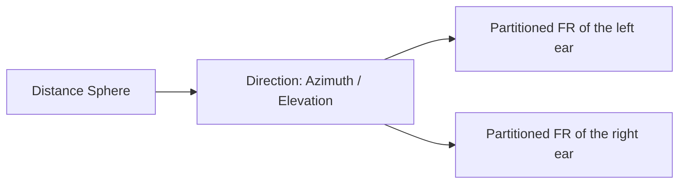
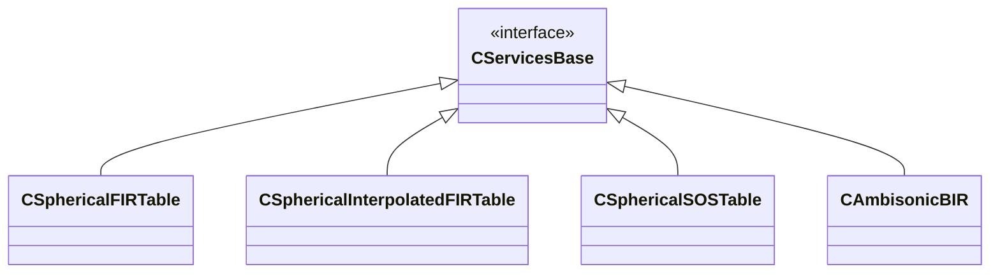

# Spherical Interpolated FIRT able

## Overview

_SphericalInterpolatedFIRTable_ is a Service Module designed to store and manage **finite impulse response (FIR) data organized in spherical coordinates**. It extends the concept of spatial FIR storage by generating a **regular spherical sampling grid through interpolation**. This regularized representation provides predictable spatial indexing and facilitates efficient access during rendering. The module is particularly suited for datasets such as HRTFs or source directivity measurements that originate from irregular measurement distributions.

## Role in the Architecture

Within the BRT architecture, Service Modules provide structured access to resources used by rendering algorithms. _SphericalInterpolatedFIRTable_ stores spatial FIR datasets that are typically loaded by **Readers** from external formats such as SOFA files. **Processing Models** then query this module during runtime to retrieve impulse responses corresponding to specific spatial directions. This separation allows algorithms to remain independent from file formats and raw dataset organization.

## Data Organization

The data is organized as a collection of **distance-dependent spherical tables**. Each distance defines a *distance bucket*, representing a measurement sphere centered on the listener. Inside each bucket, impulse responses are indexed by **azimuth and elevation**, forming a regular directional grid. This structure allows the system to manage datasets that contain measurements at multiple listener-source distances.

For HRTF datasets, each distance bucket corresponds to a **measurement sphere around the listener**. During rendering, the system typically selects the **closest available sphere** to the requested source distance. This approach preserves the physical meaning of distance-dependent measurements while keeping runtime access efficient.

Within each sphere, the directional grid is generated through **barycentric interpolation of the original measurements**. This produces a consistent spatial sampling even when the source dataset is irregular. At runtime, Processing Models can either retrieve the **nearest grid direction** or perform a **fast barycentric interpolation** between neighboring directions for smoother spatial transitions.

**Internal FIR Representation**

Before being stored in the module, the HRIRs are transformed into a representation optimized for real-time convolution. Each HRIR is partitioned into fragments matching the input buffer size in order to support **[Uniformly Partitioned Overlap-Save (UPOLS) convolution](../processing-modules/uniform-partitioned-convolution.md)**. An FFT is then applied to every partition and the resulting spectra are stored in memory by the Service Module. As a result, the binaural rendering stage performs convolution directly in the **frequency domain**, significantly improving computational efficiency.

The following diagram summarizes the **preprocessing** and **runtime stages** involved in the internal representation of HRIR data.

<div style="border: 1px solid #000; padding: 10px; display: inline-block;">
    
    <p style="text-align: center;">Offline interpolation process diagram.</p>
</div>

<figure markdown style="width:100%; border: 1px solid #000;">

<figcaption>Online process diagram.</figcaption>
</figure>

### Data store hierarchy



## Interpolation Strategy

For applications requiring **smooth and continuous 3DoF binaural rendering**, BRT provides interpolation capabilities within this Service Module. This is particularly useful in dynamic virtual environments when the available HRTF measurements do not form a regular or dense directional grid. Many datasets contain sparse measurements or large regions without data, which can lead to discontinuities when rendering directly from the measured points.

To address this limitation, _SphericalInterpolatedFIRTable_ estimates HRIRs for the **exact direction and distance of the sound source**. During an **offline preprocessing stage**, the algorithm identifies the three closest measured directions surrounding each target grid point. A **barycentric interpolation** is then performed between the corresponding HRIRs to estimate the impulse response at that location.

The result of this preprocessing step is a **regular spherical grid of FIR responses**, which is stored internally by the module. The density of this grid is controlled by a configurable parameter called **spatial resolution**, which defines the angular sampling of the generated spherical mesh. Higher spatial resolutions produce denser grids and more accurate spatial reconstruction, at the cost of increased memory usage and preprocessing time.  This regularization allows Processing Models to perform efficient spatial lookups during rendering. Additional real-time interpolation between neighboring grid points can also be applied when smoother directional transitions are required. You can find more details on how this grid is generated in this <a href="../../../assets/technical-report/SONICOM_TR3.1_BRT REGULAR GRID DISTRIBUTION OF POINTS IN THE SPHERE USED BY THE BRT.pdf" target="_blank">document</a>.

Interpolating HRIRs with different **interaural time differences (ITDs)** can introduce audible artifacts and degrade rendering quality. To avoid this issue, the HRTF Service Module handles **ITDs independently from the FIR interpolation and convolution processes**. This separation prevents temporal inconsistencies when combining impulse responses from different measurement directions. For this reason, user-imported HRIR datasets should provide **ITD information stored separately from the impulse responses**. 

After the spatial interpolation step, the appropriate ITD can be applied to the rendered signal. These ITDs may be estimated by interpolating the ITDs associated with the three nearest HRIR measurements, or in another extra feature, they could synthesized from geometric information such as **interaural azimuth and listener head circumference**.

## Supported Data Types

The module can store several types of spatial FIR datasets used in binaural rendering:

- **HRTFs (Head-Related Transfer Functions)** – impulse responses describing how sound from a spatial direction is filtered by the listener’s anatomy.  
- **Source directivity datasets** – directional impulse responses describing how a sound source radiates energy in space.  

These datasets share the common property of representing **direction-dependent acoustic filtering**.

## Typical Use Cases

A typical use case is **binaural rendering with interpolated HRTFs**, where the rendering engine queries impulse responses for arbitrary source directions. The regular grid generated by this module simplifies spatial interpolation and improves runtime predictability. Another use case is modeling **directional sound sources**, where the source radiation pattern is represented as FIR responses over a spherical domain. The module can also support research workflows where measured datasets must be resampled to a consistent spatial resolution.

## Related Service Modules

**SphericalFIRTable**

Stores FIR responses indexed by spherical coordinates but **preserves the original measurement distribution**. It does not generate a regular grid and therefore relies on the spatial structure provided by the dataset.

**SphericalSOSTable**

Stores spatial filters represented as **second-order section (SOS) filter banks** instead of FIR impulse responses. This representation is typically used when parametric or IIR filter models are preferred over impulse responses.

## Summary

_SphericalInterpolatedFIRTable_ provides a structured container for **spatial FIR datasets resampled onto a regular spherical grid**. By separating spatial resource management from rendering algorithms, it supports modular and flexible binaural processing pipelines. The module enables predictable spatial lookup and simplifies interpolation during runtime. Within the BRT architecture, it acts as a bridge between **dataset Readers and binaural Processing Models**, supporting reproducible research in spatial audio rendering.

## For C++ developer
<details>
<summary>For C++ developer</summary>

<ul>
<li><strong>File</strong>: /include/ServiceModules/SphericalInterpolatedFIRTable.hpp</li>
<li><strong>Class name</strong>: CSphericalInterpolatedFIRTable</li>
<li><strong>Inheritance</strong>: CServicesBase</li>
<li><strong>Namespace</strong>: BRTServices</li>
</ul> 

<h2>Class inheritance diagram</h2>


<h2>How to instantiate and load</h2>
```cpp
// Assuming SOFA_FILEPATH contains the SOFA filename including the path
std::shared_ptr<BRTServices::CSphericalInterpolatedFIRTable> hrtf = std::make_shared<BRTServices::CSphericalInterpolatedFIRTable>();
bool hrtfSofaLoaded = LoadSofaFile(SOFA_FILEPATH, hrtf);        
    if (!hrtfSofaLoaded) {
        // ERROR
    }
```

<h2>How to connect it to a listener</h2>
```cpp
// Assuming that the ID of this listener is contained in _listenerID and 
// that the HRTF is already lsuccessfuly loaded into hrtf.
std::shared_ptr<BRTBase::CListener> listener = brtManager->GetListener(listenerID);
listener->SetHRTF(hrtf);
```

<h2>Public Methods of <code>CSphericalInterpolatedFIRTable</code></h2>

<table>
<thead>
<tr>
<th>Category</th>
<th>Method</th>
<th>Description</th>
</tr>
</thead>

<tbody>

<tr>
<td>Constructor</td>
<td><code>CSphericalInterpolatedFIRTable()</code></td>
<td>Creates an empty spherical FIR table with interpolation support.</td>
</tr>

<tr>
<td rowspan="3">ITD Customization</td>
<td><code>void EnableWoodworthITD() override</code></td>
<td>Enables Woodworth ITD model for interaural delay estimation.</td>
</tr>
<tr>
<td><code>void DisableWoodworthITD() override</code></td>
<td>Disables the Woodworth ITD model.</td>
</tr>
<tr>
<td><code>bool IsWoodworthITDEnabled() const override</code></td>
<td>Returns whether the Woodworth ITD model is currently enabled.</td>
</tr>

<tr>
<td rowspan="2">FIR Partition Info</td>
<td><code>const int32_t GetNumberOfSubfiltersFR() const override</code></td>
<td>Returns the number of frequency-domain FIR partitions.</td>
</tr>
<tr>
<td><code>const int32_t GetSubfilterLengthFR() const override</code></td>
<td>Returns the length of each partitioned FIR subfilter.</td>
</tr>

<tr>
<td rowspan="6">Cranial Geometry</td>
<td><code>void SetHeadRadius(float _headRadius) override</code></td>
<td>Sets the head radius used for spatial calculations.</td>
</tr>
<tr>
<td><code>float GetHeadRadius() const override</code></td>
<td>Returns the current head radius.</td>
</tr>
<tr>
<td><code>void RestoreHeadRadius() override</code></td>
<td>Restores the default head radius value.</td>
</tr>
<tr>
<td><code>void SetEarPosition(Common::T_ear _ear, Common::CVector3 _earPosition) override</code></td>
<td>Sets the local position of the specified ear.</td>
</tr>
<tr>
<td><code>Common::CVector3 GetEarLocalPosition(Common::T_ear _ear) const override</code></td>
<td>Returns the local position of the specified ear.</td>
</tr>
<tr>
<td><code>void SetCranialGeometryAsDefault() override</code></td>
<td>Resets cranial geometry parameters to default values.</td>
</tr>

<tr>
<td>Measurement Metadata</td>
<td><code>double GetDistanceOfMeasurement(const Common::CTransform &amp; _referenceLocation, const double &amp; _azimuth, const double &amp; _elevation, const double &amp; _distance) const override</code></td>
<td>Returns the distance associated with the selected/nearest measurement for the given spatial query.</td>
</tr>

<tr>
<td rowspan="2">IR Windowing</td>
<td><code>void SetWindowingParameters(float _fadeInBegin, float _riseTime, float _fadeOutCutoff, float _fallTime) override</code></td>
<td>Configures fade-in and fade-out window parameters applied to impulse responses.</td>
</tr>
<tr>
<td><code>void GetWindowingParameters(float &amp; _fadeInWindowThreshold, float &amp; _fadeInWindowRiseTime, float &amp; _fadeOutWindowThreshold, float &amp; _fadeOutWindowRiseTime) const override</code></td>
<td>Returns the current impulse response windowing parameters.</td>
</tr>

<tr>
<td rowspan="2">Interpolation Grid</td>
<td><code>void SetGridSamplingStep(int _samplingStep) override</code></td>
<td>Sets the sampling step of the internal interpolation grid.</td>
</tr>
<tr>
<td><code>int GetGridSamplingStep() const override</code></td>
<td>Returns the current interpolation grid sampling step.</td>
</tr>

<tr>
<td rowspan="3">FIR Table Setup</td>
<td><code>bool BeginSetup(const int32_t &amp; _HRIRLength, const BRTServices::TEXTRAPOLATION_METHOD &amp; _extrapolationMethod) override</code></td>
<td>Initializes the table configuration before inserting impulse responses.</td>
</tr>
<tr>
<td><code>void AddIR(const Common::CVector3 &amp; _referencePosition, const double &amp; _azimuth, const double &amp; _elevation, const double &amp; _distance, TIRStruct &amp;&amp; _newIR) override</code></td>
<td>Adds a new impulse response measurement to the table.</td>
</tr>
<tr>
<td><code>bool EndSetup() override</code></td>
<td>Finalizes the table structure after all impulse responses have been added.</td>
</tr>

<tr>
<td rowspan="2">FIR Retrieval</td>
<td><code>const TFRPartitions GetFR_SpatiallyOriented(const float &amp; _azimuth, const float &amp; _elevation, const float &amp; _distance, const Common::CTransform &amp; _referenceLocation, const Common::T_ear &amp; ear, bool _runTimeInterpolation) const override</code></td>
<td>Returns the frequency-domain FIR partitions for one ear at a given spatial direction (with optional runtime interpolation).</td>
</tr>
<tr>
<td><code>const Common::CEarPair&lt;TFRPartitions&gt; GetFR_SpatiallyOriented_2Ears(const float &amp; _azimuth, const float &amp; _elevation, const float &amp; _distance, const Common::CTransform &amp; _referenceLocation, bool _runTimeInterpolation) const override</code></td>
<td>Returns the frequency-domain FIR partitions for both ears (with optional runtime interpolation).</td>
</tr>

<tr>
<td>Delay Retrieval</td>
<td><code>const Common::CEarPair&lt;uint64_t&gt; GetFR_Delay(const float &amp; _azimuthCenter, const float &amp; _elevationCenter, const float &amp; _distance, const Common::CTransform &amp; _referenceLocation, bool _runTimeInterpolation) const override</code></td>
<td>Returns the interaural delays associated with the selected FIR responses (with optional runtime interpolation).</td>
</tr>

</tbody>
</table>
</details>
