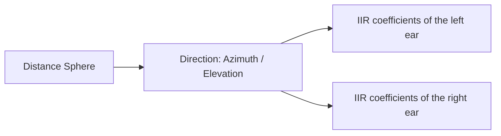

# Spherical SOS Table

## Overview
_SphericalSOSTable_ is a Service Module designed to store **second-order section (SOS) filter coefficients** within the BRT architecture. These coefficients represent parametric filter structures that may either remain constant or vary spatially. The module is particularly useful for representing direction-dependent filters such as **near-field compensation filters** or other parametric acoustic corrections. By organizing SOS filters in a spatial structure, the module enables efficient retrieval of the filter corresponding to a given listener–source direction.

## Role in the Architecture
Within the BRT architecture, _SphericalSOSTable_ acts as a **resource container** accessed by Processing Models during runtime. Processing Models query the module to obtain the appropriate SOS filter coefficients based on the current spatial configuration. The data stored in the module is typically loaded by **Readers**, which parse external formats and convert them into the internal spatial organization used by BRT. This separation allows resource management to remain independent from the signal processing algorithms.

## Data Organization
The data is organized as a **collection of spherical tables, one for each distance**. Each distance defines a *distance bucket*, representing a measurement sphere centered at the listener. Within each bucket, filters are indexed by **azimuth and elevation**, forming a regular directional grid. This structure allows the module to manage datasets containing measurements taken at multiple source–listener distances. During rendering, the system selects the **closest available sphere** to the requested source distance, preserving the physical meaning of distance-dependent measurements while maintaining efficient runtime access.

Inside each distance bucket, the IIR filters are organized according to their **azimuth and elevation coordinates**. A **KD-tree spatial structure** is used to perform efficient nearest-neighbor searches within the table. This allows the system to retrieve the closest available measurement direction whenever an exact directional match is not present.

Although this is the primary design, the structure is flexible enough to support other usage patterns. The module can also store **direction-independent filters** by inserting coefficients with azimuth, elevation, and distance set to zero. In this case, a single filter per ear can be stored and retrieved without any spatial dependency.

Another example of this flexibility can be seen in our implementation of the **near-field effect filters**. In this instance, the coefficients are indexed by interaural azimuth, with elevation fixed at zero. This approach exploits the symmetry of the acoustic response with respect to the interaural axis. Further details about this configuration can be found in the *Near-Field* [section](../processing-modules/nearfield-effect-processor.md).

### Data store hierarchy

## Supported Data Types
The module stores **parametric filter representations** expressed as cascades of second-order sections. Each entry typically contains the numerator and denominator coefficients of the SOS structure. This representation is commonly used for efficient and numerically stable implementations of IIR filters. Both **single filters** and **spatially varying collections of filters** can be represented within the same framework.

## Typical Use Cases
A couple of common use cases might be: storing **near-field compensation filters** that vary depending on the distance between the sound source and the listener. The processing models responsible for near-field rendering can query the module to obtain the appropriate SOS filter for the current source direction. Another use of this module is to store filters for simulating direction-independent filters, such as protective headphones or a very simple equalisation device. 

## Related Service Modules
**SphericalFIRTable**

_SphericalFIRTable_ stores **impulse responses (FIR filters)** organized spatially, typically representing HRTFs or BRIRs. In contrast, _SphericalSOSTable_ stores **parametric IIR filters expressed as SOS coefficients**, which are generally more compact and suitable for certain acoustic corrections. 

**SphericalInterpolatedFIRTable**

 _SphericalInterpolatedFIRTable_ performs interpolation between spatial measurements, _SphericalSOSTable_ typically retrieves the filter associated with the closest available spatial position. These modules therefore address different filter representations and rendering needs.

## Summary
_SphericalSOSTable_ provides a structured way to store and access **spatially organized parametric filters** within BRT. By representing filters as SOS coefficients and organizing them over spherical coordinates, the module supports efficient retrieval of direction-dependent filtering resources. It complements FIR-based resource modules and enables Processing Models to integrate parametric acoustic corrections into binaural rendering pipelines.